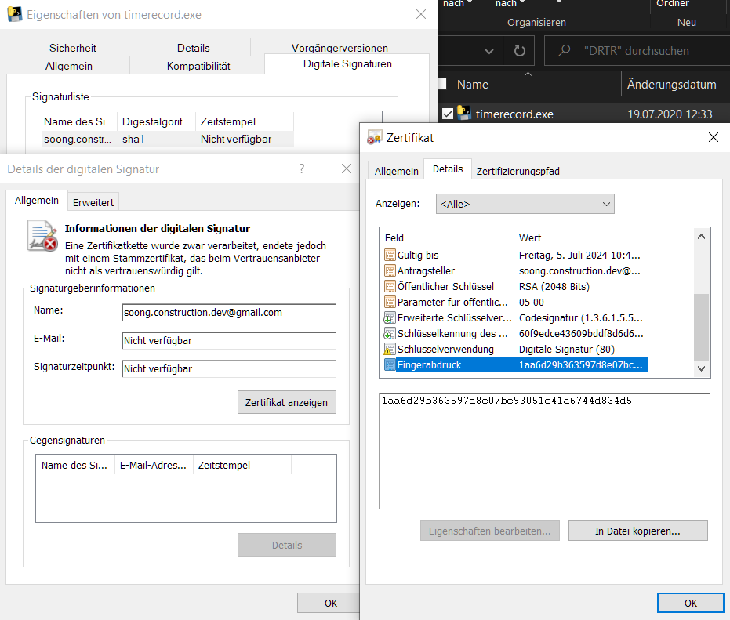

## Trusting the executable

When running this program from the pre-built .exe, Windows SmartScreen Defender might warn you about an unknown publisher or untrusted certificate. This is expected, as the executable is signed with the author's personal self-signed certificate. Properly signing with a root certificate trusted by Windows and other operating systems is costly and requires funding that this project does not have. 

You should still check the `timerecord.exe` and verify it's actually original. To this end, it has been signed with a certificate that is described in the next section. To ensure your `timerecord.exe` has not been tampered with, open its certificate by viewing its properties through the context menu. Navigate to Digital Signatures, then Details, select View Certificate, then again Details (cf. screenshots in German Locale). 

> Note: The same warning might appear for the included .bat files. Although it is not possible to sign .bat files, you can right click on any in the installation folder and select Edit to see it contains only SQLite calls, i.e. interaction with the database.




A quicker way is through the PowerShell: `(Get-AuthenticodeSignature -FilePath timerecord.exe).SignerCertificate` 

Compare the fields *Subject* and *Thumbprint* to the expected values below.

Note: Prior to version 2.8.2, the `timerecord.exe` was not signed and you cannot verify its origin.

## Check the certificate

The certificate subject is:

```
CN = soong.construction.dev@gmail.com
O = github.com/soong-construction
```

The certificate thumbprint is (case does not matter):

```
1AA6D29B363597D8E07BC93051E41A6744D834D5
```
